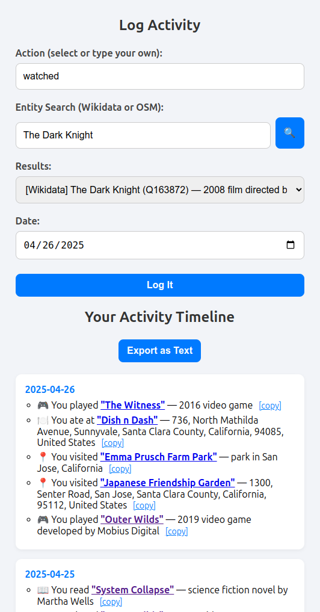
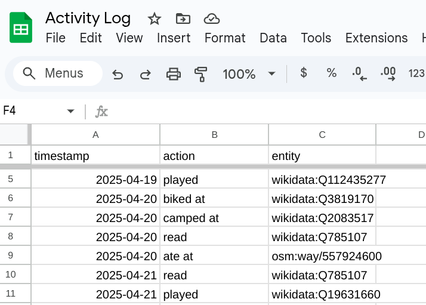

# EntityLog

A lightweight activity logger that uses structured data from Wikidata and OpenStreetMap, stored privately in Google Sheets.

---

## What is this?

EntityLog lets you:
- Search for real-world entities (from Wikidata and OpenStreetMap)
- Log actions like "watched", "played", "ate at", etc
- View your activities in a clean timeline
- Export the full history as readable text

All your data is stored safely in a private **Google Sheets** file.  
The frontend is pure HTML + JavaScript, no backend servers needed.

---

## Why it's useful

- **Augments your memory:**  
  Remember what you did, where you went, and what you consumed — forever.

- **Future-proof for AI and LLMs:**  
  When exported as text, the activity log is conveniently usable for LLM analysis, personalization, activity recommendations, and other applications.

- **Enables advanced analysis:**  
  Structured data is perfect for running analytics, creating visualizations, summarizing your activities, or generating insights over time.

---

## Why structured entities?

Instead of freeform notes ("I went to Starbucks"),  
EntityLog saves the **entity IDs**.

- Structured IDs from Wikidata/OSM become richer over time — your old entries gain more metadata automatically.

- Structured metadata enables advanced analytics, better filtering, smarter summaries, and more precise querying in the future.

---

## Data Ownership and Portability

You **own 100% of your data**:

- It's stored in a simple, editable Google Sheet
- You can export it anytime as CSV
- You can migrate it to your own database or storage system if desired

No lock-in, no dependency on hidden proprietary formats.

---

## Will it last forever?

- **Wikidata and OpenStreetMap** are open-source, long-term projects.
- Even if either service disappears someday, you still have the raw entity IDs.
- **Since IDs are stable and based on free/open data**, it is possible for another service or community to mirror the content.
- If **Google Sheets** ever sunsets, you can export your activities as simple CSV files and import them elsewhere.

Your history remains **yours for life**.

---

## Privacy

- **No logins required.**  
  For convenience and simplicity, there's no authentication system.

- **Privacy by obscurity:**  
  The main privacy defense is **keeping your Google Sheets URL and webpage URL private**.

- **Easy to rotate:**  
  If a leak is suspected, simply duplicate your Sheet and update the code to point to the new path.

This method is simple, robust, and under your full control.

---

## Easy Customization

EntityLog is:
- Fully open source
- Plain HTML + JavaScript (no build tools needed)
- Very easy to modify action types, icons, timeline styling, and backend setup

Customize it to match your lifestyle, logging needs, or even integrate into a broader personal dashboard.

---

## Why Google Sheets?

- **Convenient:** Easily editable manually if needed.
- **Exportable:** Supports CSV, Excel, and API access.
- **Free:** No hosting fees.

---

## Setup Instructions

### 1. Create a Google Sheet

- Create a new Google Sheet
- Add a **header row**:  
  `timestamp`, `action`, `entity`
- Publish the sheet to the web:
  - `File > Share > Publish to Web`
  - Get the **public CSV URL**  
    (should end in `&output=csv`)

Example:  
`https://docs.google.com/spreadsheets/d/e/.../pub?gid=0&single=true&output=csv`

---

### 2. Set up the Google Apps Script (to allow POST logging)

- Open your Sheet
- Click `Extensions > Apps Script`
- Paste this script:

```javascript
function doPost(e) {
  const sheetId = "YOUR-HARDCODED-SHEET-ID-HERE"; // <- hardcoded
  const ss = SpreadsheetApp.openById(sheetId);
  const sheet = ss.getSheets()[0];

  const timestamp = e.parameter.timestamp || new Date().toISOString().split("T")[0];
  const action = (e.parameter.action || "").trim();
  const entity = (e.parameter.qid || e.parameter.entity || "").trim();

  if (!timestamp || !action || !entity) {
    return ContentService.createTextOutput("Missing required fields.").setMimeType(ContentService.MimeType.TEXT);
  }

  sheet.appendRow([timestamp, action, entity]);

  return ContentService.createTextOutput("Success").setMimeType(ContentService.MimeType.TEXT);
}
```

- Replace `YOUR-HARDCODED-SHEET-ID-HERE` with your actual Google Sheet ID.  You can find the Sheet ID in the URL of your Google Sheet between `/d/` and `/edit`.
- Save the project
- Deploy as a **Web App**:
  - `Deploy > New Deployment`
  - Select **Web App**
  - Set **Execute as:** *Me*  
  - Set **Who has access:** *Anyone*

You will get a **Web App URL** — save this, it will be used in the HTML frontend.

---

### 3. Set up the HTML Page

- Download the provided `entitylog.html`
- Edit these two parameters at the top of the `<script>` section:

```javascript
const webAppURL = "YOUR_WEB_APP_URL_HERE";
const SHEET_CSV_URL = "YOUR_SHEET_CSV_URL_HERE";
```

- Host the HTML file:
  - You can open it locally or host it on a web server

---

## Example Screenshots





---

## License

This project is open source under the **MIT License**.  
Use it, modify it, build on it freely.
